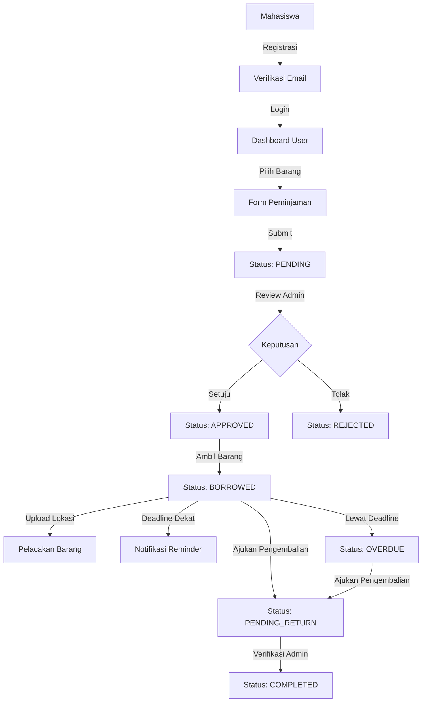

#  LabIoT - Sistem Peminjaman Lab IoT Vokasi UB

[](https://laravel.com)
[](https://php.net)
[](https://mysql.com)
[](https://tailwindcss.com)
[](https://alpinejs.dev)

> Sistem manajemen terintegrasi untuk peminjaman perangkat IoT di Laboratorium Internet of Things dan Human-Centered Design Fakultas Vokasi Universitas Brawijaya.

<p align="center">
  
</p>

## 📝 Deskripsi Proyek

LabIoT adalah aplikasi web berbasis Laravel yang dikembangkan untuk mengelola proses peminjaman perangkat di Laboratorium Internet of Things (IoT) dan Human-Centered Design Fakultas Vokasi Universitas Brawijaya. Aplikasi ini didesain untuk menggantikan sistem manual dengan platform digital yang terorganisir, mudah digunakan, dan dapat dilacak.

### 🎯 Tujuan Pembuatan
Aplikasi ini dibuat untuk tujuan akademik dan operasional lab, dengan fokus pada peningkatan efisiensi proses administrasi laboratorium dan pemeliharaan inventaris.

### 📈 Manfaat Aplikasi
- **Bagi Mahasiswa**: Kemudahan akses untuk meminjam perangkat lab tanpa harus datang langsung
- **Bagi Kepala Lab**: Pemantauan inventaris yang lebih baik dan pelacakan status perangkat
- **Bagi Institusi**: Peningkatan akuntabilitas penggunaan aset laboratorium

## ✨ Fitur Utama

### 👨‍🎓 Fitur untuk Mahasiswa/Peminjam
- [x] **Registrasi dan Verifikasi Email** - Proses pendaftaran dengan verifikasi email otomatis
- [x] **Login Multi-metode** - Login dengan email/NIM dan password
- [x] **Peminjaman Barang** - Form peminjaman online dengan detail lengkap
- [x] **Status Peminjaman** - Pelacakan status peminjaman secara real-time
- [x] **Pelacakan Barang** - Upload foto lokasi barang yang dipinjam
- [x] **Notifikasi** - Pemberitahuan email untuk deadlines dan reminder
- [x] **Pengembalian Barang** - Pengajuan permintaan pengembalian
- [x] **Riwayat Peminjaman** - Catatan lengkap peminjaman personal

### 👨‍💼 Fitur untuk Admin/Kepala Lab
- [x] **Dashboard Admin** - Statistik dan notifikasi real-time
- [x] **Manajemen Inventaris** - CRUD barang dengan status ketersediaan
- [x] **Persetujuan Peminjaman** - Sistem persetujuan/penolakan dengan notifikasi
- [x] **Verifikasi Pengembalian** - Konfirmasi pengembalian barang
- [x] **Pelacakan Lokasi** - Monitoring lokasi barang yang dipinjam
- [x] **Laporan** - Pembuatan laporan peminjaman (PDF & Excel)
- [x] **Manajemen Pengguna** - Aktivasi/suspend akun mahasiswa
- [x] **Sistem Notifikasi** - Notifikasi terintegrasi untuk admin

### 🎨 UI/UX & Experience
- [x] **Dark Mode Support** - Tampilan ramah mata untuk kondisi minim cahaya
- [x] **Responsive Design** - Tampilan optimal di Mobile, Tablet, dan Desktop
- [x] **Interactive Feedback** - Toast notifications, skeleton loading, dan validasi real-time
- [x] **Map Integration** - Integrasi peta interaktif untuk pelacakan lokasi

## 🛡️ Keamanan & Performa (New!)

### 🔒 Keamanan Tingkat Lanjut
- **Rate Limiting**: Perlindungan terhadap Brute Force Attack pada login
- **Security Headers**: Implementasi HSTS, X-Frame-Options, dan X-XSS-Protection
- **File Validation**: Validasi ketat MIME type dan magic numbers untuk upload file
- **Input Sanitization**: Pencegahan total terhadap SQL Injection dan XSS

### ⚡ Optimasi Performa
- **Caching System**: Implementasi caching untuk data statis dan konfigurasi
- **Database Indexing**: Query database yang dioptimasi dengan index yang tepat
- **Eager Loading**: Eliminasi masalah N+1 Query untuk load halaman super cepat
- **Asset Optimization**: Kompresi dan minifikasi aset statis

## 🚀 Demo

<p align="center">
  <a href="https://labiot.vokasiub.ac.id" target="_blank">
    
  </a>
</p>

### 🔑 Akun Demo
- **Admin**
  - Email: `admin@example.com`
  - Password: `password`
- **Mahasiswa**
  - Email: `user@example.com`
  - Password: `password`

## ⚙️ Teknologi yang Digunakan

### 🔙 Backend
- **Bahasa Pemrograman**: PHP 8.2+
- **Framework**: Laravel 11.x
- **Database**: MySQL 8.0+
- **Authentication**: Multi-guard auth dengan email verification
- **File Storage**: Laravel Storage dengan symbolic links

### 🖥️ Frontend
- **CSS Framework**: TailwindCSS 3.4.x
- **JavaScript Framework**: Alpine.js 3.x
- **Icons**: Lucide Icons
- **UI Components**: Custom components dengan TailwindCSS
- **UI Components**: Custom components dengan TailwindCSS (Forms, Modals, Cards)
- **Maps**: Leaflet.js & OpenStreetMap
- **Notifications**: SweetAlert2 11.x & Toastify

### 📚 Library Utama
- **Carbon**: Manipulasi tanggal & waktu
- **Laravel Mail**: Notifikasi email
- **Laravel Excel**: Export data ke Excel
- **DomPDF**: Pembuatan laporan PDF
- **SweetAlert2**: Notifikasi UI yang interaktif

### 🛠️ Tools Pendukung
- **Version Control**: Git
- **Development Environment**: XAMPP/Laragon
- **Database Management**: PHPMyAdmin/TablePlus
- **Email Testing**: Mailtrap/Gmail SMTP
- **Deployment**: Docker (opsional)

## 🏗️ Arsitektur Sistem

### 🔄 Alur Kerja Sistem



### 📊 Struktur Database

#### Users
- `id`: Primary key
- `name`: Nama lengkap
- `nim`: NIM mahasiswa (unique)
- `email`: Email (unique)
- `email_verified_at`: Timestamp verifikasi
- `password`: Password terenkripsi
- `profile_photo`: Path foto profil
- `phone`: Nomor telepon
- `role`: Role (admin/user)
- `status`: Status akun (active/inactive/suspended)
- `last_login_at`: Timestamp login terakhir

#### Items
- `id`: Primary key
- `name`: Nama barang
- `category`: Kategori barang
- `quantity`: Jumlah stok
- `image`: Path gambar barang
- `status`: Status (available/maintenance/unavailable)
- Timestamps

#### BorrowRequests
- `request_id`: Primary key
- `user_id`: Foreign key ke Users
- `item_id`: Foreign key ke Items
- `quantity`: Jumlah dipinjam
- `borrow_date`: Tanggal peminjaman
- `return_deadline`: Batas waktu pengembalian
- `status`: Status peminjaman (enum)
- `approval_date`: Tanggal persetujuan
- `borrowed_at`: Timestamp pengambilan
- `purpose`: Tujuan peminjaman
- `return_date`: Tanggal pengembalian aktual
- `return_status`: Status pengembalian
- `notes`: Catatan tambahan
- Timestamps

#### ItemTracking
- `tracking_id`: Primary key
- `borrow_request_id`: Foreign key ke BorrowRequests
- `location`: Lokasi barang
- `notes`: Catatan tambahan
- `photo`: Path foto barang
- `tracked_by`: ID user pelacak
- `tracking_date`: Timestamp pelacakan
- Timestamps

#### Notifications
- `id`: Primary key
- `user_id`: Foreign key ke Users
- `message`: Isi notifikasi
- `status`: Status terkait
- `request_id`: Foreign key ke BorrowRequests
- `sent_at`: Timestamp pengiriman
- `read_at`: Timestamp dibaca
- Timestamps

## 📱 Tampilan Aplikasi

### 🌐 Landing Page
Landing page modern dengan informasi lengkap tentang sistem peminjaman, fitur utama, dan panduan penggunaan.

### 👨‍🎓 Dashboard Mahasiswa
- **Dashboard**: Statistik peminjaman dan barang tersedia
- **Peminjaman**: Form peminjaman dengan detail barang
- **Status Peminjaman**: Tracking status peminjaman aktif
- **Riwayat**: Catatan lengkap peminjaman sebelumnya
- **Profil**: Pengaturan akun dan data pribadi

### 👨‍💼 Dashboard Admin
- **Dashboard**: Statistik dan notifikasi real-time
- **Manajemen Barang**: CRUD inventaris dengan status
- **Persetujuan Peminjaman**: Review dan approval permintaan
- **Pengembalian Barang**: Verifikasi pengembalian
- **Laporan**: Generasi laporan dengan filter lengkap
- **Pengelolaan User**: Manajemen akun mahasiswa

## 🔐 Keamanan Sistem

### 🛡️ Fitur Keamanan
- **Password Hashing**: Algoritma bcrypt
- **CSRF Protection**: Token pada semua form
- **Rate Limiting**: Batasan percobaan login
- **Session Timeout**: Auto logout setelah inaktif
- **Input Validation**: Validasi server-side
- **XSS Protection**: Escape output otomatis
- **SQL Injection Protection**: Query Builder & Eloquent
- **Role-Based Access Control**: Multi-guard authentication

### 🔒 Best Practices
- **Sanitasi Input/Output**: Pencegahan XSS dan injeksi
- **Logging**: Pencatatan aktivitas sensitif
- **TLS/SSL**: Enkripsi komunikasi
- **Backup Otomatis**: Perlindungan data

## 🚀 Panduan Instalasi

### 📋 Persyaratan Sistem
- PHP 8.2 atau lebih tinggi
- Composer 2.5+
- Node.js 18+ dan NPM 9+
- MySQL 8.0+
- Git
- Minimal 2GB RAM (4GB direkomendasikan)
- 10GB ruang disk

### ⬇️ Instalasi dengan Git

#### 🪟 Windows

1. **Persiapan Lingkungan**
   - Install [XAMPP](https://www.apachefriends.org/download.html) atau [Laragon](https://laragon.org/download/) untuk PHP, MySQL, dan Apache
   - Install [Composer](https://getcomposer.org/download/)
   - Install [Node.js](https://nodejs.org/)
   - Install [Git](https://git-scm.com/download/win)

2. **Clone Repository**
   ```bash
   git clone https://github.com/qcsixx/labiot.git
   cd labiot
   ```

3. **Install Dependensi PHP**
   ```bash
   composer install
   ```

4. **Install Dependensi JavaScript**
   ```bash
   npm install
   npm run build # untuk production
   # ATAU
   npm run dev # untuk development
   ```

5. **Setup Environment**
   ```bash
   copy .env.example .env
   php artisan key:generate
   ```

6. **Konfigurasi Database di File .env**
   ```
   DB_CONNECTION=mysql
   DB_HOST=127.0.0.1
   DB_PORT=3306
   DB_DATABASE=labiot
   DB_USERNAME=root
   DB_PASSWORD=password_anda
   ```

7. **Konfigurasi Email di File .env**
   ```
   MAIL_MAILER=smtp
   MAIL_HOST=smtp.gmail.com
   MAIL_PORT=587
   MAIL_USERNAME=your-email@gmail.com
   MAIL_PASSWORD=your-app-password
   MAIL_ENCRYPTION=tls
   MAIL_FROM_ADDRESS=your-email@gmail.com
   MAIL_FROM_NAME="Lab IoT Vokasi UB"
   ```

8. **Migrasi & Seed Database**
   ```bash
   php artisan migrate --seed
   ```

9. **Setup Symbolic Link untuk Storage**
   ```bash
   php artisan storage:link
   ```

10. **Jalankan Server Development**
    ```bash
    php artisan serve
    ```

11. **Akses Aplikasi**
    - Buka browser dan akses: `http://localhost:8000`
    - Login admin default:
      - Email: admin@example.com
      - Password: password

#### 🐧 Linux/Ubuntu

1. **Persiapan Lingkungan**
   ```bash
   # Update repository
   sudo apt update

   # Install PHP dan ekstensi yang dibutuhkan
   sudo apt install php8.2 php8.2-cli php8.2-common php8.2-curl php8.2-mbstring php8.2-mysql php8.2-xml php8.2-zip php8.2-gd

   # Install Composer
   curl -sS https://getcomposer.org/installer | php
   sudo mv composer.phar /usr/local/bin/composer
   sudo chmod +x /usr/local/bin/composer

   # Install Node.js dan NPM
   curl -fsSL https://deb.nodesource.com/setup_18.x | sudo -E bash -
   sudo apt install -y nodejs

   # Install MySQL
   sudo apt install mysql-server
   sudo mysql_secure_installation

   # Buat database
   sudo mysql -e "CREATE DATABASE labiot;"
   sudo mysql -e "CREATE USER 'labiot'@'localhost' IDENTIFIED BY 'password_anda';"
   sudo mysql -e "GRANT ALL PRIVILEGES ON labiot.* TO 'labiot'@'localhost';"
   sudo mysql -e "FLUSH PRIVILEGES;"
   ```

2. **Clone Repository**
   ```bash
   git clone https://github.com/qcsixx/labiot.git
   cd labiot
   ```

3. **Install Dependensi PHP**
   ```bash
   composer install --optimize-autoloader --no-dev # untuk production
   # ATAU
   composer install # untuk development
   ```

4. **Install Dependensi JavaScript**
   ```bash
   npm install
   npm run build # untuk production
   # ATAU
   npm run dev # untuk development
   ```

5. **Setup Environment**
   ```bash
   cp .env.example .env
   php artisan key:generate
   ```

6. **Konfigurasi Database di File .env**
   ```
   DB_CONNECTION=mysql
   DB_HOST=127.0.0.1
   DB_PORT=3306
   DB_DATABASE=labiot
   DB_USERNAME=labiot
   DB_PASSWORD=password_anda
   ```

7. **Konfigurasi Email di File .env**
   ```
   MAIL_MAILER=smtp
   MAIL_HOST=smtp.gmail.com
   MAIL_PORT=587
   MAIL_USERNAME=your-email@gmail.com
   MAIL_PASSWORD=your-app-password
   MAIL_ENCRYPTION=tls
   MAIL_FROM_ADDRESS=your-email@gmail.com
   MAIL_FROM_NAME="Lab IoT Vokasi UB"
   ```

8. **Migrasi & Seed Database**
   ```bash
   php artisan migrate --seed
   ```

9. **Setup Symbolic Link untuk Storage**
   ```bash
   php artisan storage:link
   ```

10. **Atur Permission**
    ```bash
    sudo chown -R $USER:www-data .
    sudo chmod -R 775 storage bootstrap/cache
    sudo chmod -R 775 public/uploads
    ```

11. **Konfigurasi Apache (Opsional untuk Deployment)**
    ```bash
    sudo nano /etc/apache2/sites-available/labiot.conf
    ```
    
    Tambahkan konfigurasi berikut:
    ```
    <VirtualHost *:80>
        ServerName labiot.local
        DocumentRoot /path/to/labiot/public
        
        <Directory /path/to/labiot/public>
            Options Indexes FollowSymLinks
            AllowOverride All
            Require all granted
        </Directory>
        
        ErrorLog ${APACHE_LOG_DIR}/labiot-error.log
        CustomLog ${APACHE_LOG_DIR}/labiot-access.log combined
    </VirtualHost>
    ```
    
    Aktifkan site dan restart Apache:
    ```bash
    sudo a2ensite labiot.conf
    sudo a2enmod rewrite
    sudo systemctl restart apache2
    ```

12. **Jalankan Server Development**
    ```bash
    php artisan serve
    ```

13. **Setup Scheduler (untuk fitur notifikasi otomatis)**
    ```bash
    crontab -e
    ```
    
    Tambahkan baris berikut:
    ```
    * * * * * cd /path/to/labiot && php artisan schedule:run >> /dev/null 2>&1
    ```

14. **Akses Aplikasi**
    - Buka browser dan akses: `http://localhost:8000`
    - Login admin default:
      - Email: admin@example.com
      - Password: password

### 🐳 Instalasi dengan Docker

1. **Persiapan Docker**
   - Windows: [Install Docker Desktop](https://www.docker.com/products/docker-desktop)
   - Linux: 
     ```bash
     sudo apt update
     sudo apt install docker.io docker-compose
     sudo systemctl enable --now docker
     sudo usermod -aG docker $USER
     # Log out dan masuk kembali
     ```

2. **Clone Repository**
   ```bash
   git clone https://github.com/username/labiot.git
   cd labiot
   ```

3. **Build dan Jalankan Container**
   ```bash
   docker-compose up -d
   ```

4. **Masuk ke Container dan Setup**
   ```bash
   docker-compose exec app bash
   composer install
   cp .env.example .env
   php artisan key:generate
   php artisan migrate --seed
   php artisan storage:link
   ```

5. **Akses Aplikasi**
   - Buka browser dan akses: `http://localhost:8000`

## 🧩 Fitur Utama (Detail)

### 🔐 Autentikasi & Keamanan
- **Multi-guard Authentication**: Pemisahan akses admin dan user
- **Email Verification**: Verifikasi email otomatis
- **Password Reset**: Fitur reset password dengan token
- **Session Management**: Pengelolaan session dengan timeout
- **Activity Logging**: Pencatatan aktivitas login/logout

### 📦 Manajemen Inventaris
- **Kategori Barang**: Pengelompokan barang berdasarkan kategori
- **Status Barang**: Available, Maintenance, Unavailable
- **Stok Management**: Tracking jumlah barang tersedia
- **Upload Gambar**: Visualisasi barang dengan foto
- **Riwayat Barang**: Tracking penggunaan setiap barang

### 📝 Peminjaman Barang
- **Form Dinamis**: Form peminjaman dengan validasi real-time
- **Approval System**: Sistem persetujuan multi-level
- **Status Tracking**: Pelacakan status peminjaman
- **Deadline Management**: Pengelolaan batas waktu pengembalian
- **Notifikasi**: Pemberitahuan untuk setiap perubahan status

### 📍 Pelacakan Barang
- **Location Tracking**: Pelacakan lokasi barang
- **Photo Evidence**: Bukti foto keberadaan barang
- **History Log**: Riwayat lengkap pelacakan
- **Verification**: Verifikasi data pelacakan oleh admin

### 📊 Laporan & Analitik
- **Export PDF/Excel**: Ekspor data ke berbagai format
- **Filter & Search**: Pencarian dan filter data laporan
- **Statistik**: Visualisasi data peminjaman
- **Periodic Reports**: Laporan berkala (harian/bulanan/tahunan)

### 👥 Manajemen Pengguna
- **Role Management**: Pengelolaan peran pengguna
- **Account Status**: Aktivasi/suspend akun
- **Profile Management**: Pengelolaan profil pengguna
- **Activity Tracking**: Pelacakan aktivitas pengguna

## 📱 Responsivitas & Kompatibilitas

Aplikasi ini didesain dengan pendekatan mobile-first dan dioptimasi untuk berbagai perangkat:

| Platform | Browser | Versi Minimum |
|----------|---------|---------------|
| Desktop  | Chrome  | 90+           |
|          | Firefox | 90+           |
|          | Safari  | 14+           |
|          | Edge    | 90+           |
| Mobile   | Chrome  | 90+           |
|          | Safari  | 14+           |
| Tablet   | Chrome  | 90+           |
|          | Safari  | 14+           |

## 🧠 Alur Autentikasi Lengkap

### 📝 Registrasi & Onboarding
1. **Registrasi Pengguna Baru**
   - Pengunjung mengakses halaman landing page
   - Mengisi form registrasi dengan data lengkap
   - Sistem melakukan validasi data
   - Akun dibuat dengan status `unverified`

2. **Verifikasi Email**
   - Email verifikasi dikirim dengan token unik
   - Pengguna mengklik link verifikasi
   - Sistem memvalidasi token
   - Status akun berubah menjadi `verified`

3. **Aktivasi Akun**
   - Admin menerima notifikasi pendaftaran baru
   - Admin memverifikasi data pengguna
   - Status akun diubah menjadi `active`
   - Pengguna menerima notifikasi aktivasi

### 🔑 Proses Login
1. **Autentikasi**
   - Pengguna menginput email/NIM dan password
   - Sistem memverifikasi kredensial
   - Pengecekan status akun
   - Pembuatan session dan cookie

2. **Role-based Redirect**
   - Admin: Redirect ke dashboard admin
   - User: Redirect ke dashboard user

## 📧 Notifikasi Email

### 📨 Tipe Email
- **Verifikasi Akun**: Setelah registrasi
- **Status Peminjaman**: Perubahan status permintaan
- **Reminder Harian**: Pengingat barang dipinjam
- **Notifikasi H-1**: Pengingat batas waktu pengembalian
- **Notifikasi Deadline**: Pengingat hari terakhir
- **Peringatan Overdue**: Notifikasi keterlambatan

## 🛠️ Troubleshooting

### ❓ Masalah Umum & Solusi

1. **Email Tidak Terkirim**
   - Periksa konfigurasi SMTP di `.env`
   - Pastikan akun Google mengizinkan "Less secure apps"
   - Verifikasi log di `storage/logs/laravel.log`

2. **Permission Error**
   ```bash
   chmod -R 775 storage bootstrap/cache
   chmod -R 775 public/uploads
   ```

3. **Upload Gambar Gagal**
   - Pastikan symbolic link storage sudah dibuat
   ```bash
   php artisan storage:link
   ```

4. **Scheduler Tidak Berjalan**
   - Verifikasi crontab telah disetup dengan benar
   - Cek log di `storage/logs/borrow-reminders.log`

5. **Perubahan Tidak Terlihat (Cache Issue)**
   - Sistem menggunakan caching agresif untuk performa. Jika perubahan tidak muncul:
   ```bash
   php artisan optimize:clear
   php artisan view:clear
   php artisan cache:clear
   ```

6. **Error 500 / Blank Page**
   - Cek permission folder storage:
   ```bash
   sudo chmod -R 775 storage bootstrap/cache
   sudo chown -R $USER:www-data storage bootstrap/cache
   ```

## 👤 Tentang Pengembang

<p align="center">
  
</p>

**Nama**: M. Rifqi Primanda Putra   
**Institusi**: Fakultas Vokasi, Universitas Brawijaya  
**Program Studi**: Teknologi Informasi dan Komputer   
**Angkatan**: 2022  
**Email**: rifqiprimanda27@gmail.com  

**Judul Proyek Akhir**:  
"Pengembangan Sistem Informasi Peminjaman Perangkat di Laboratorium IoT Fakultas Vokasi Universitas Brawijaya"

## 📜 Lisensi

Aplikasi ini dikembangkan untuk keperluan akademik dan operasional internal Fakultas Vokasi Universitas Brawijaya. Hak cipta dilindungi dan penggunaan oleh pihak luar memerlukan izin tertulis dari pengembang dan institusi.

## 🔗 Referensi & Dokumentasi

- [Laravel Documentation](https://laravel.com/docs)
- [Tailwind CSS Documentation](https://tailwindcss.com/docs)
- [Alpine.js Documentation](https://alpinejs.dev/start-here)
- [MySQL Documentation](https://dev.mysql.com/doc/)

---

<p align="center">
  
  <br>
  <small>© 2023-2024 Laboratorium IoT Vokasi UB. All rights reserved.</small>
</p>
